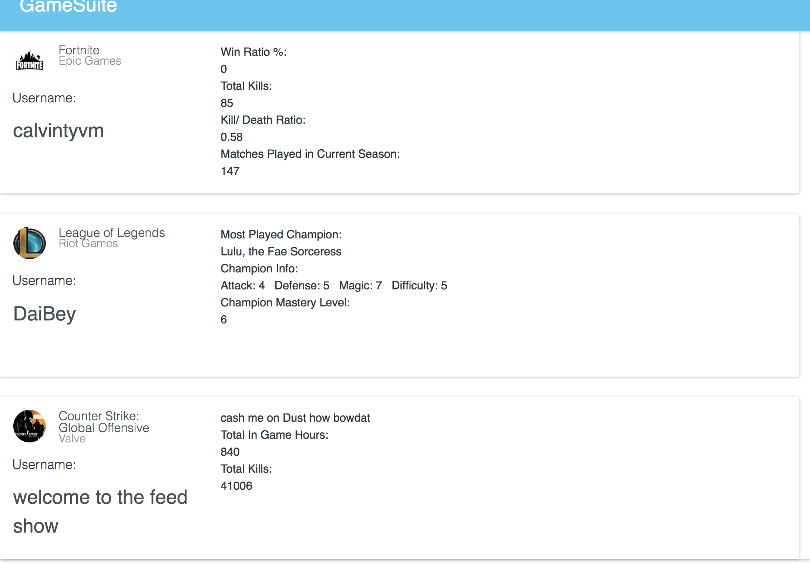
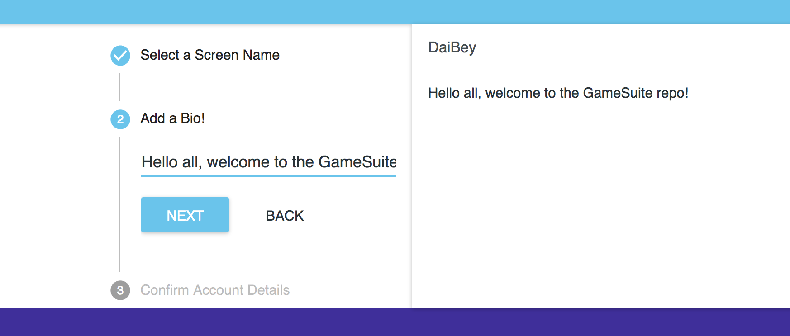

# GameSuite

<p align="center">
    <a href='https://www.npmjs.com/' alt='NPM Version'>
        
    </a>
    <a href='https://www.meteor.com/' alt='Meteor Version'>
        
    </a>
    <a href='https://www.mongodb.com/' alt='MongoDB Version'>
        
    </a>
    <a href='https://reactjs.org/' alt='React Version'>
        
    </a>
        <a href='https://www.gnu.org/licenses/agpl-3.0' alt='GNU AGPLV3 License'>
        
    </a>

</p>

> GameSuite is a centralized platform for competitive gamers where players can chat, organize and view in-game statistics from and about various different games.

<br/>

## A Glimpse

---




<br/>

## Table of Contents

---

* [Install](#install)
* [Usage](#usage)
* [API](#api)
* [Maintainers](#maintainers)
* [Contribute](#contribute)
* [License](#license)

<br/>

## Install

---

To install GameSuite, run

```
$ git clone https://github.com/2lives/GameSuite.git
```

then inside the GameSuite folder run

```
$ npm install
```

to install all npm dependencies.

### Dependencies

You will also need to have [Meteor](https://www.meteor.com/) installed

<br/>

## Usage

---

Once you have it downloaded, inside the GameSuite folder,
run

```
$ meteor
```

to start up the project.

<br/>

## API

---

### IMPORTANT!

You will need to supply Your own API keys for this program to work!

<br/>

### RiotAPI - https://developer.riotgames.com/

---

<u>**Get Champion List**</u>

* #### URL

> `https://na1.api.riotgames.com/lol/static-data/v3/champions?locale=en_US&champListData=image&champListData=info&dataById=false&api_key=${LeagueAPIKey}`,

* #### Method

> GET

* #### URL Params


    LeagueAPIkey = Your Riot API key

</br >

<u>**Get Account Information By Summoner Name**</u>

* #### URL

> `https://na1.api.riotgames.com/lol/summoner/v3/summoners/by-name/${summonerName}?api_key=${LeagueAPIKey}`,

* #### Method

> GET

* #### URL Params


    summonerName = A summoner name </br> LeagueAPIkey = Your RIOT API key

</br>

<u>**Get Champion Mastery**</u>

* #### URL

> `https://na1.api.riotgames.com/lol/champion-mastery/v3/champion-masteries/by-summoner/{summonerId}?api_key=${LeagueAPIKey}`,

* #### Method

> GET

* #### URL Params


    summonerId = A summoner id </br>
    LeagueAPIkey = Your Riot API key

    </br>

<u>**Get Champion Mastery**</u>

* #### URL

> `https://na1.api.riotgames.com/lol/champion-mastery/v3/champion-masteries/by-summoner/{summonerId}?api_key=${LeagueAPIKey}`,

* #### Method

> GET

* #### URL Params


    summonerId = A summoner id </br>
    LeagueAPIkey = Your Riot Developer API key

</br>

### SteamAPI - https://steamcommunity.com/dev/apikey

---

<u>**Get Steam Account Summary**</u>

* #### URL

  > `http://api.steampowered.com/ISteamUser/GetPlayerSummaries/v0002/?key=${SteamAPIkey}&steamids=${steamId}`,

* #### Method

> GET

* #### URL Params


    steamId = A Steam Account ID </br>
    SteamAPIkey = Your Steam API key

</br >

<u>**Get Account Information By Summoner Name**</u>

* #### URL

> `http://api.steampowered.com/ISteamUserStats/GetUserStatsForGame/v0002/?appid=730&key=${SteamAPIkey}&steamid=${steamId}`,

* #### Method

> GET

* #### URL Params


    steamId = A Steam Account ID </br>
    SteamAPIkey = Your Steam API key

</br>

### Fortnite Tracker API - https://fortnitetracker.com/site-api

---

<u>**Get Fortnite Account Data**</u>

* #### URL

  > `https://api.fortnitetracker.com/v1/profile/pc/${accountName}`,

* #### Header

        headers: {
          'TRN-Api-Key': '{FortniteAPIKey}'
        }

* #### Method

> GET

* #### URL Params


    accountName = A PC Fortnite Account Name</br>
    FortniteAPIKey = Your Fortnite Tracker API key

</br >

## Maintainers

---

[@2lives](https://github.com/2lives)
and
[@EricChan277](https://github.com/EricChan277)

</br>

## Contribute

---

Sorry, we are not open to contributors at this time!

<br/>

## License

---

GNU AGPLv3 © 2018 Eric Chan
